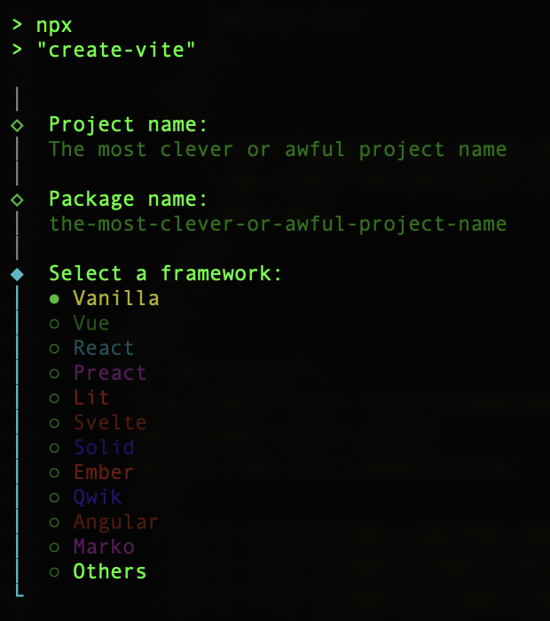
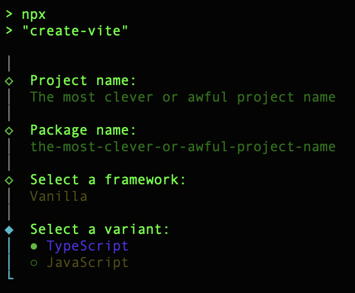
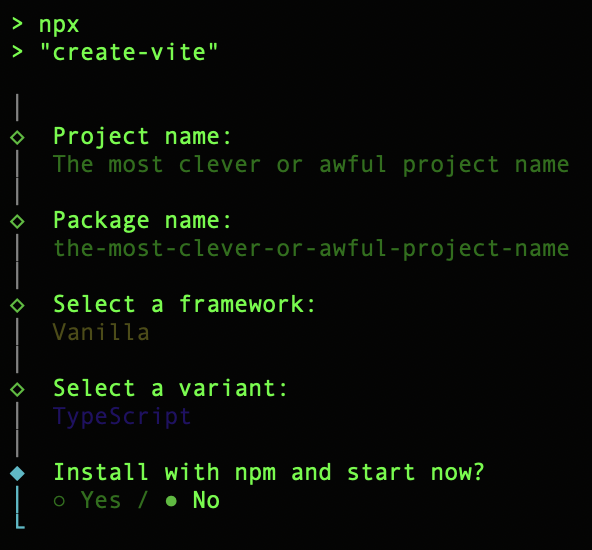

# Graphit Typescript example
<p align="center">
  <br/>
  
</p>
this is step by step setup for integrating graphit with your typescript project.

we are using [Vite](https://vite.dev) to build and test [Graphit](https://github.com/shinogati/graphit) WASM interface.

1. create vanila typescript project with Vite:
```shell
npm create vite@latest
```
2. choose your package name and select **Vanila** then **TypeScript** then **No**



3. go to project root directory and install graphit wasm library
```shell
cd "The most clever or awful project name"
```
```shell
npm i @shinogati/graphit esbuild rollup
```

4. install dependencies to enable vite dev server to serve the wasm file.
```shell
npm i vite-plugin-wasm vite-plugin-top-level-await
```
5. edit package.json and add rollup to package resolutions:
```json
{
  ...
  },
  "resolutions": {
    "rollup": "npm@rollup/wasm-node"
  }
}
```
6. create or edit `vite.config.ts`:
```json
import { defineConfig } from 'vite'
import wasm from 'vite-plugin-wasm'
import topLevelAwait from 'vite-plugin-top-level-await'

// https://vite.dev/config/
export default defineConfig({
  plugins: [wasm(), topLevelAwait()],
  build: {
    target: 'es2022',
  },
})
```